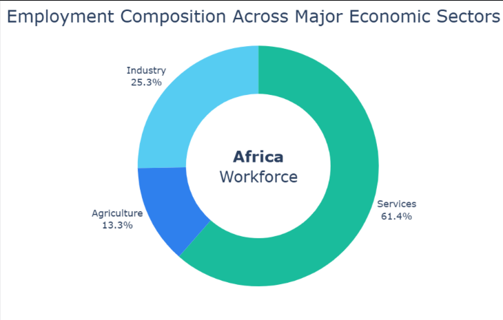
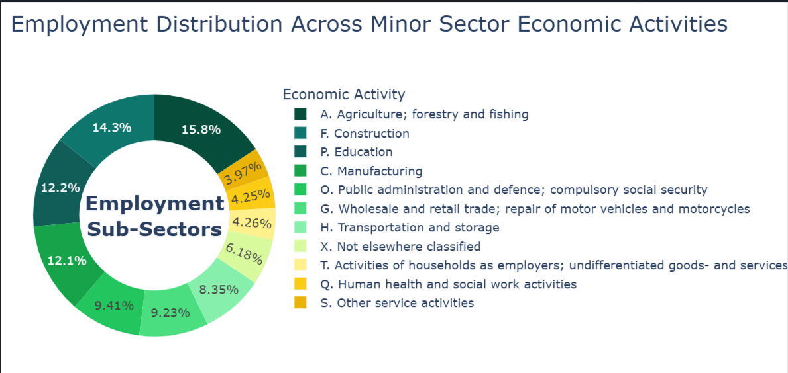
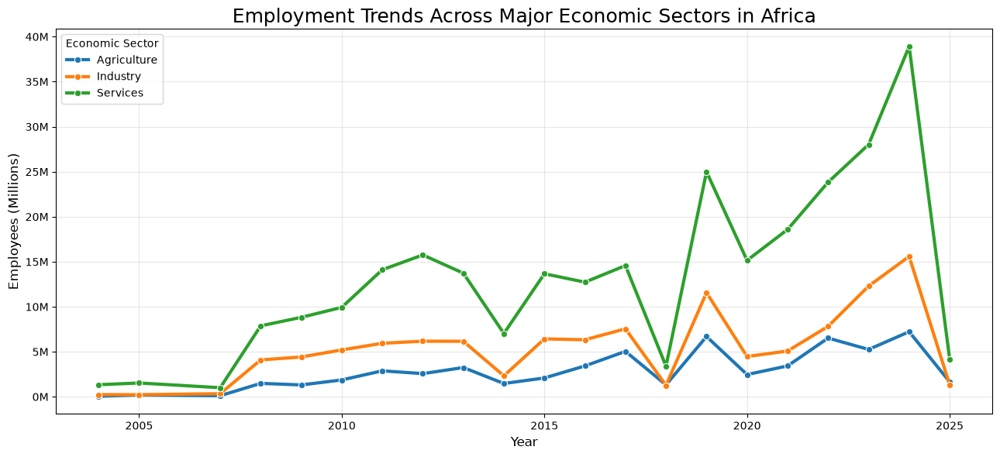

# 🌍 Job-lens - An African employment trend and forecasting platform.

## Project Description

Job-lens is a data-driven solution developed to analyze historical employment trends across African countries and forecast future employment patterns .
The platform transforms labour market data into interactive visualizations and predictive insights to support evidence-based decision-making for policymakers, researchers, investors, and job seekers.

---

# Dataset

**Dataset Name:** ILOSTAT Employment by Economic Activity Dataset

**Source:** [Hugging Face](https://huggingface.co/datasets/electricsheepafrica/africa-ilo-ees-tees-sex-ifl-eco-nb-employees-by-sex-informal-formal-job-and-economic/?lang=en)

**Dataset Size:**

| Metric | Value |
|--------|------:|
| Records | 39,600+ |
| Countries | Multiple African Countries |
| Time Period | Multiple Years |
| Variables | Employment, Economic Activity, Gender, Employment Type, Country, Year |

**Key Features**

- Country
- Year
- Economic Activity (ISIC Rev.4)
- Employment Type (Formal / Informal)
- Gender
- Number of Employees (Thousands)
- Data Quality Indicators

---
# Exploratory Data Analysis:

* Service provisions have employed the highest number of people


* Under the minor sector, agriculture individually has the highest number of employees.


* Over time, service provision has been generally employing a higher workforce gradually.

---

# Tech Stack

- Python 3
- Pandas
- NumPy
- Matplotlib
- Seaborn
- Plotly
- Scikit-LLearn
- Prophet
- Streamlit

---

# How to Run

1. Clone the repository.

```bash
git clone https://github.com/Babji-1/labourlens.git
```

2. Navigate into the project folder.

```bash
cd labourlens
```

3. Install the required packages.

```bash
pip install -r requirements.txt
```

4. Launch the Streamlit application.

```bash
streamlit run app.py
```

5. Explore employment trends, interactive dashboards, and employment forecasts across African countries.

---

# Key Findings

- Services and agriculture account for the largest share of employment across many African economies.
- Informal employment is the more significantly rising employment sector from a holistic view.
- Employment distribution differs considerably by economic activity.
- Time series forecasting provides insights into future employment trends based on historical labour market data.
- Interactive dashboards improve accessibility of labour market intelligence for policy and investment decisions, as well as personal decisions.

---

## 🔗 Project Resources

| Resource | Link |
|----------|------|
| 🌐 [Live Application] | (https://job-lens-africa.streamlit.app/) |
| 📊 [Tableau Dashboard]|(https://public.tableau.com/app/profile/kennedy.kiiru/viz/Book1_17852643851940/Dashboard1)
| 🎤 [Project Presentation] |(https://canva.link/tuibxyagni8shrb) |
| 💻 Source Code | (https://github.com/Babji-1/job-lens-Africa)

---

# A Project by

**Kennedy Kiiru**

GitHub: https://github.com/Babji-1

---

# License

This project is licensed under the **MIT License**.
